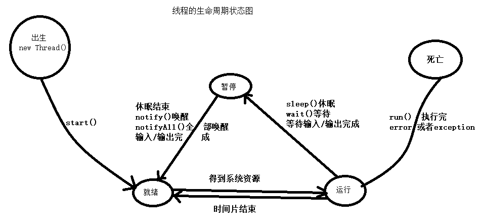

# 进程、线程与多线程

**进程和线程有什么区别**？

这个一个最常见，却最不好回答的问题，csdn上面一位博主给出的[解答](http://blog.csdn.net/forrest2009/article/details/6413756)和另一位cnblog博主的[解答](http://www.cnblogs.com/engine1984/archive/2007/08/22/865562.html)稍微清晰些一些，总结起来，就是一下的几个区别：

- 进程是资源分配的基本单位，线程是cpu调度，或者说是程序执行的最小单位。在Mac、Windows NT等采用微内核结构的操作系统中，进程的功能发生了变化：它只是资源分配的单位，而不再是调度运行的单位。**在微内核系统中，真正调度运行的基本单位是线程。因此，实现并发功能的单位是线程**。

- 进程有独立的地址空间，比如在linux下面启动一个新的进程，系统必须分配给它独立的地址空间，建立众多的数据表来维护它的代码段、堆栈段和数据段，这是一种非常昂贵的多任务工作方式。**而运行一个进程中的线程，它们之间共享大部分数据，使用相同的地址空间，因此启动一个线程，切换一个线程远比进程操作要快，花费也要小得多**。当然，线程是拥有自己的局部变量和堆栈（注意不是堆）的，比如在windows中用[_beginthreadex](http://blog.csdn.net/morewindows/article/details/7421759)创建一个新进程就会在调用CreateThread的同时申请一个专属于线程的数据块（_tiddata)。

- **线程之间的通信比较方便**。统一进程下的线程共享数据（比如全局变量，静态变量），通过这些数据来通信不仅快捷而且方便，当然如何处理好这些访问的同步与互斥正是编写多线程程序的难点。而进程之间的通信只能通过[进程通信](http://baike.baidu.com/view/549640.htm)的方式进行。

- 由b，可以轻易地得到结论：多进程比多线程程序要健壮。**一个线程死掉整个进程就死掉了，但是在[保护模式](http://blog.csdn.net/wukaiyu/article/details/1766804)下，一个进程死掉对另一个进程没有直接影响**。

- 线程的执行与进程是有区别的。每个独立的线程有有自己的一个程序入口，顺序执行序列和程序的出口，但是线程不能独立执行，必须依附与程序之中，由应用程序提供多个线程的并发控制。

**什么是线程安全**？

- 如果多线程的程序运行结果是可预期的，而且与单线程的程序运行结果一样，那么说明是“线程安全”的。

[秒杀多线程中的题目](http://blog.csdn.net/morewindows/article/details/7392749) 解答

- [线程的概念、线程的基本状态及状态之间的关系](http://www.360doc.com/content/06/1213/10/15870_292102.shtml)

  另外，[这个网址](http://www.91computer.com/cs/cs_jcglxc1.asp)里面讲操作系统的知识倒是挺详实的，还有另外一种解释[线程概念](http://blog.csdn.net/wolenski/article/details/7969908)

- 多线程的几种实现方法分别是什么？

  这个貌似在java面试中会出现，我是专注于c++的，无视掉，但是不得不说，[秒杀多线程面试题系列](http://blog.csdn.net/column/details/killthreadseries.html)真心是个好总结

- 多线程同步与互斥有几种实现方法？都是什么？（C++）

  临界区（CS:critical section）、事件（Event）、互斥量（Mutex）、信号量（semaphores），需要注意的是，临界区是效率最高的，因为基本不需要其他的开销，二内核对象涉及到用户态和内核态的切换，开销较大，另外，关键段、互斥量具有[线程所有权](http://blog.csdn.net/morewindows/article/details/7442639)的概念，因此只可以用于线程之间互斥，而不能用到同步中。**只有互斥量能完美解决进程意外终止所造成的“遗弃问题”**。

- 多线程同步和互斥有何异同，在什么情况下分别使用他们？举例说明

  所谓同步，表示有先有后，比较正式的解释是“线程同步是指线程之间所具有的一种制约关系，一个线程的执行依赖另一个线程的消息，当它没有得到另一个线程的消息时应等待，直到消息到达时才被唤醒。”

  所谓互斥，比较正式的说明是“线程互斥是指对于共享的进程系统资源，在各单个线程访问时的排它性。当有若干个线程都要使用某一共享资源时，任何时刻最多只允许一个线程去使用，其它要使用该资源的线程必须等待，直到占用资源者释放该资源。线程互斥可以看成是一种特殊的线程同步。”表示不能同时访问，也是个顺序问题，所以互斥是一种特殊的同步操作。

## Thread && Runnable

**第一题：线程的基本概念、线程的基本状态及状态之间的关系**？

线程，有时称为轻量级进程，是CPU使用的基本单元；它由线程ID、程序计数器、寄存器集合和堆栈组成。**它与属于同一进程的其他线程共享其代码段、数据段和其他操作系统资源（如打开文件和信号）**。

线程有四种状态：新生状态、可运行状态、被阻塞状态、死亡状态。状态之间的转换如下图所示：

**第二题：线程与进程的区别**？

-  线程是进程的一部分，所以线程有的时候被称为是轻权进程或者轻量级进程。
- 一个没有线程的进程是可以被看作单线程的，如果一个进程内拥有多个进程，进程的执行过程不是一条线（线程）的，而是多条线（线程）共同完成的。
- 系统在运行的时候会为每个进程分配不同的内存区域，但是不会为线程分配内存（线程所使用的资源是它所属的进程的资源），线程组只能共享资源。那就是说，出了CPU之外（线程在运行的时候要占用CPU资源），计算机内部的软硬件资源的分配与线程无关，线程只能共享它所属进程的资源。
- 与进程的控制表PCB相似，线程也有自己的控制表TCB，但是TCB中所保存的线程状态比PCB表中少多了。
- 进程是系统所有资源分配时候的一个基本单位，拥有一个完整的虚拟空间地址，并不依赖线程而独立存在。

**第三题：多线程有几种实现方法，都是什么**？

- 继承 Thread 类

- 实现 Runnable 接口再 new Thread(YourRunnableOjbect) 

**第四题：多线程同步和互斥有几种实现方法，都是什么**？

线程间的同步方法大体可分为两类：**用户模式和内核模式**。顾名思义，内核模式就是指利用系统内核对象的单一性来进行同步，使用时需要切换内核态与用户态，而用户模式就是不需要切换到内核态，只在用户态完成操作。

用户模式下的方法有：

- 原子操作（例如一个单一的全局变量）
- 临界区

内核模式下的方法有：

- 事件
- 信号量
- 互斥量

**第五题：多线程同步和互斥有何异同，在什么情况下分别使用他们？举例说明**。

线程同步是指线程之间所具有的一种制约关系，一个线程的执行依赖另一个线程的消息，当它没有得到另一个线程的消息时应等待，直到消息到达时才被唤醒。

线程互斥是指对于共享的进程系统资源，在各单个线程访问时的排它性。当有若干个线程都要使用某一共享资源时，任何时刻最多只允许一个线程去使用，其它要使用该资源的线程必须等待，直到占用资源者释放该资源。线程互斥可以看成是一种特殊的线程同步（下文统称为同步）。

