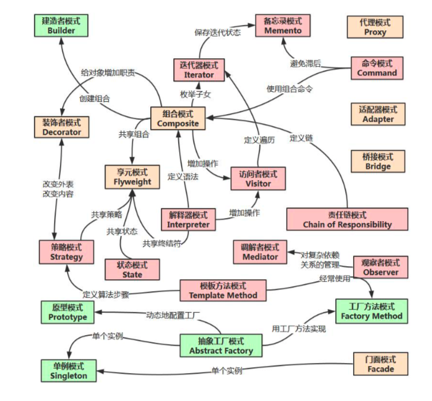
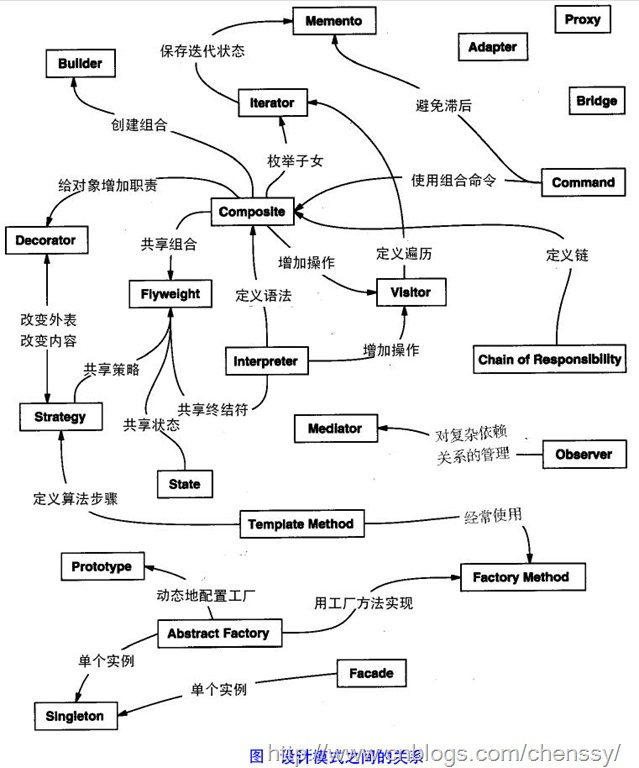

# C++ 设计模式

> [设计模式总结（C++和Python实现）](<https://www.jianshu.com/p/0b2a6ec0ee3d>)
>
> [设计模式精解－GoF 23 种设计模式解析附 C++实现源码](<http://ccftp.scu.edu.cn/Download/038c70a8-c724-4b86-91c3-74b927b1d492.pdf>)







最常用的

- 单例
- 观察者
- 责任链

次一点的

- 工厂

- 装饰器

- 适配器等

## 1. 单例模式

作用：保证一个类只有一个实例，并提供一个访问它的全局访问点，使得系统中只有唯一的一个对象实例。

应用：常用于管理资源，如日志、线程池

实现要点：

- 在类中，要构造一个实例，就必须调用类的构造函数，并且为了保证全局只有一个实例，

- 需防止在外部调用类的构造函数而构造实例，需要将构造函数的访问权限标记为private，

- 同时阻止拷贝创建对象时赋值时拷贝对象，因此也将它们声明并权限标记为private；

- 另外，需要提供一个全局访问点，就需要在类中定义一个static函数，返回在类内部唯一构造的实例。

```c++
class Singleton{
public:
    static Singleton& getInstance(){
        static Singleton instance;
        return instance;
    }
    void printTest(){
        cout<<"do something"<<endl;
    }
 
private:
    Singleton(){}//防止外部调用构造创建对象
    Singleton(Singleton const &singleton);//阻止拷贝创建对象
    Singleton& operator=(Singleton const &singleton);//阻止赋值对象
 
};
 
int main()
{
    Singleton &a=Singleton::getInstance();
    a.printTest();
    return 0;
}
```

首先，构造函数声明成 private 的目的是只允许内部调用，getInstance() 中的静态局部变量创建时调用，但不允许外部调用构造创建第二个实例；

然后，拷贝构造和拷贝赋值符是声明成了private而不给出定义，其目的是阻止拷贝，如果企图通过拷贝构造来创建第二个实例，编译器会报错。

阻止拷贝的另一种写法是声明后接一个"=delete",也能起到相同的作用（C++11）。

## 2. 工厂模式
工厂模式包括三种：

- 简单工厂模式
- 工厂方法模式
- 抽象工厂模式。

**工厂模式的主要作用是封装对象的创建，分离对象的创建和操作过程，用于批量管理对象的创建过程，便于程序的维护和扩展**。

### 2.1 简单工厂模式

简单工厂是工厂模式最简单的一种实现，对于不同产品的创建定义一个工厂类，将产品的类型作为参数传入到工厂的创建函数，根据类型分支选择不同的产品构造函数。

```c++
//简单工厂模式
typedef enum ProductTypeTag
{
    TypeA,
    TypeB,
    TypeC
} PRODUCTTYPE;
class Product//产品抽象基类
{
public:
    virtual void Show() = 0;
};
class ProductA : public Product
{
public:
    void Show(){
        cout<<"I'm ProductA"<<endl;
    }
};
class ProductB : public Product
{
public:
    void Show(){
        cout<<"I'm ProductB"<<endl;
    }
};
class ProductC : public Product
{
public:
    void Show(){
        cout<<"I'm ProductC"<<endl;
    }
};
class Factory//工厂类
{
public:
    Product* CreateProduct(PRODUCTTYPE type)
    {
        switch (type) {
        case TypeA:
            return new ProductA();
        case TypeB:
            return new ProductB();
        case TypeC:
            return new ProductC();
        default:
            return NULL;
        }
    }
};
 
int main()
{
    Factory productCreator;
    Product *productA=productCreator.CreateProduct(TypeA);
    Product *productB=productCreator.CreateProduct(TypeB);
    Product *productC=productCreator.CreateProduct(TypeC);
    productA->Show();
    productB->Show();
    productC->Show();
    if(productA){
        delete productA;
        productA=NULL;
    }
    if(productB){
        delete productB;
        productB=NULL;
    }
    if(productC){
        delete productC;
        productC=NULL;
    }
    return 0;
}
```

### 2.2 工厂方法模式

其实这才是正宗的工厂模式，简单工厂模式只是一个简单的对创建过程封装。工厂方法模式在简单工厂模式的基础上增加对工厂的基类抽象，不同的产品创建采用不同的工厂创建（从工厂的抽象基类派生），这样创建不同的产品过程就由不同的工厂分工解决：

- FactoryA 专心负责生产 ProductA，FactoryB 专心负责生产ProductB，FactoryA 和 FactoryB 之间没有关系；如果到了后期，如果需要生产 ProductC 时，我们则可以创建一个 FactoryC 工厂类，该类专心负责生产 ProductC 类产品。

该模式相对于简单工厂模式的优势在于：**便于后期产品种类的扩展**。

```c++
//工厂方法模式
typedef enum ProductTypeTag
{
    TypeA,
    TypeB,
    TypeC
} PRODUCTTYPE;
class Product//产品抽象基类
{
public:
    virtual void Show() = 0;
};
class ProductA : public Product
{
public:
    void Show(){
        cout<<"I'm ProductA"<<endl;
    }
};
class ProductB : public Product
{
public:
    void Show(){
        cout<<"I'm ProductB"<<endl;
    }
};
class ProductC : public Product
{
public:
    void Show(){
        cout<<"I'm ProductC"<<endl;
    }
};
 
class Factory//工厂类
{
public:
    virtual Product *createProduct()=0;
};
class FactoryA : public Factory{
public:
    Product *createProduct(){
        return new ProductA();
    }
};
class FactoryB : public Factory{
public:
    Product *createProduct(){
        return new ProductB();
    }
};
class FactoryC : public Factory{
public:
    Product *createProduct(){
        return new ProductC();
    }
};
 
int main()
{
        Factory *factoryA = new FactoryA();
        Product *productA = factoryA->createProduct();
        productA->Show();
        Factory *factoryB = new FactoryB();
        Product *productB = factoryB->createProduct();
        productB->Show();
        if (factoryA){
            delete factoryA;
            factoryA = NULL;
        }
        if (factoryB){
            delete factoryB;
            factoryB = NULL;
        }
        if (productA){
            delete productA;
            productA = NULL;
        }
        if (productB){
            delete productB;
            productB = NULL;
        }
        return 0;
}
```

### 2.3 抽象工厂模式

抽象工厂模式对工厂方法模式进行了更加一般化的描述。工厂方法模式适用于产品种类结构单一的场合，为一类产品提供创建的接口；**而抽象工厂方法适用于产品种类结构多的场合，就是当具有多个抽象产品类型时，抽象工厂便可以派上用场**。

抽象工厂模式更适合实际情况，受生产线所限，让低端工厂生产不同种类的低端产品，高端工厂生产不同种类的高端产品。

```c++
//抽象工厂模式
class ProductA
{
public:
    virtual void Show() = 0;
};
class ProductA1 : public ProductA//A类低端产品
{
public:
    void Show(){
        cout<<"I'm ProductA1"<<endl;
    }
};
class ProductA2 : public ProductA//A类高端产品
{
public:
    void Show(){
        cout<<"I'm ProductA2"<<endl;
    }
};

class ProductB
{
public:
    virtual void Show() = 0;
};
class ProductB1 : public ProductB//B类低端产品
{
public:
    void Show(){
        cout<<"I'm ProductB1"<<endl;
    }
};
class ProductB2 : public ProductB//B类高端产品
{
public:
    void Show(){
        cout<<"I'm ProductB2"<<endl;
    }
};
 
class Factory
{
public:
    virtual ProductA *CreateProductA() = 0;
    virtual ProductB *CreateProductB() = 0;
};
 
class Factory1 : public Factory//1号工厂用于生产低端产品
{
public:
    ProductA *CreateProductA(){
        return new ProductA1();
    }
 
    ProductB *CreateProductB(){
        return new ProductB1();
    }
};
 
class Factory2 : public Factory//2号工厂用于生产高端产品
{
    ProductA *CreateProductA(){
        return new ProductA2();
    }
 
    ProductB *CreateProductB(){
        return new ProductB2();
    }
};
 
int main()
{
    Factory *factory1 = new Factory1();
    ProductA *productA1 = factory1->CreateProductA();
    ProductB *productB1 = factory1->CreateProductB();
    productA1->Show();
    productB1->Show();
 
    Factory *factory2 = new Factory2();
    ProductA *productA2 = factory2->CreateProductA();
    ProductB *productB2 = factory2->CreateProductB();
    productA2->Show();
    productB2->Show();
 
    if (factory1){
        delete factory1;
        factory1 = NULL;
    }
    if (productA1){
        delete productA1;
        productA1= NULL;
    }
    if (productB1){
        delete productB1;
        productB1 = NULL;
    }
    if (factory2){
        delete factory2;
        factory2 = NULL;
    }
    if (productA2){
        delete productA2;
        productA2 = NULL;
    }
    if (productB2){
        delete productB2;
        productB2 = NULL;
    }
}
```


