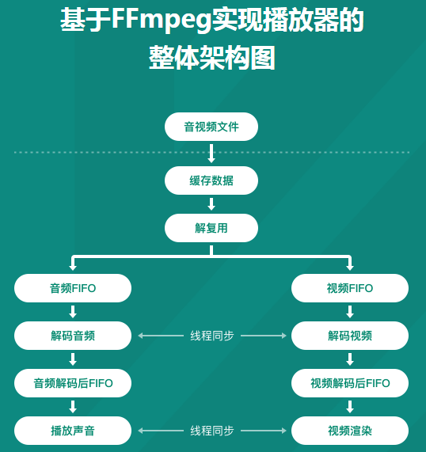
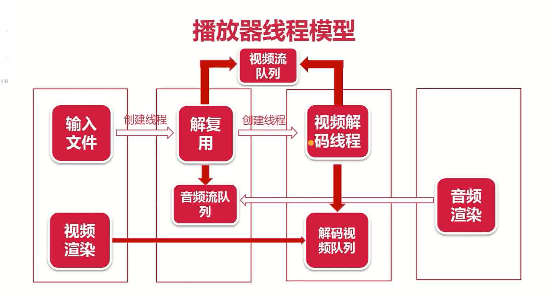
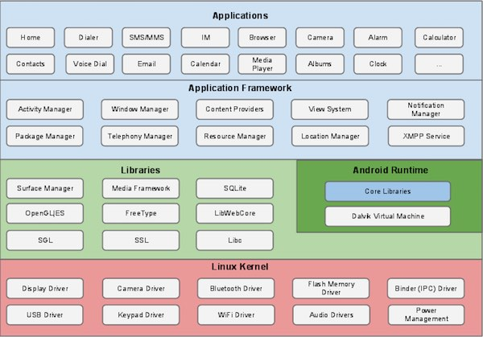
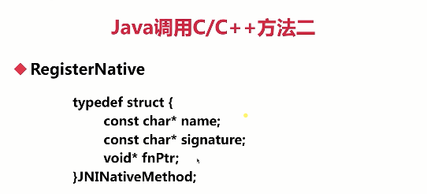
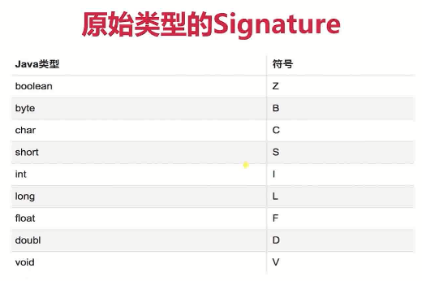

# FFmpeg 音视频核心技术




## 1. 学习大纲

**FFmpeg 常用命令**：

- 视频录制命令
- 多媒体文件的分解/复用命令
- 裁剪与合并命令
- 图片/视频互转命令
- 直播相关命令
- 各种滤镜命令

**FFmpeg 基本开发**：

- C 语言回顾
- FFmpeg 核心概念与常用结构体
- 实战 - 多媒体文件的分解与复用
- 实战 - 多媒体格式的互转
- 实战 - 从 MP4 裁剪一段视频
- 作业 - 实现一个简单的小咖秀

**音视频编解码实战**：

- 实战 - H264 解码
- 实战 - H264 编码
- 实战 - 音频 AAC 解码
- 实战 - 音频 AAC 编码
- 实战 - 视频转图片

**音视频渲染实战**：

- SDL 事件处理
- SDL 视频文理渲染
- SDL 音频渲染
- 实战1 - 实现 YUV 视频播放
- 实战2 - YUV 视频倍数播放
- 实战3 - 实现 PCM 播放器

**FFmpeg 开发播放器核心功能**：

- 实战 - 实现 MP4 文件的视频播放
- 实战 - 实现 MP4 文件的音频播放
- 实战 - 实现一个初级播放器
- 实战 - 音视频同步
- 实战 - 实现播放器内核

**Android 中实战 FFmpeg**：

- 编译 Android 端可以使用的 FFmpeg
- Java 与 C 语言相互调用
- 实战 - Android 调用 FFmpeg

**学习建议**：

- 牢牢抓住音视频的处理机制，了解其本质
- 勤加练习，熟能生巧
- 待着问题去学习，事半功倍

**音视频的广泛应用**：

- 直播类：音视频会议、教育直播、娱乐/游戏直播
- 短视频：抖音、快手、小咖秀
- 网络视频：优酷、腾讯视频、爱奇艺等
- 音视频通话：微信、QQ、Skype等
- 视频监控
- 人工智能：人脸识别，智能音箱等，更关注算法

**播放器架构**：


**渲染流程**：


**FFmpeg 都能做啥**：

- FFmpeg 是一个非常优秀的多媒体框架
- FFmpeg 可以运行在 Linux、Mac、Windows 等平台上
- 能够解码、编码、转码、复用、解复用、过滤音视频数据

**FFmpeg 下载便于与安装**：

```shell
$ git clone https://git.ffmpeg.org/ffmpeg.git
$ config -- help
$ make && make install
```

## 2. FFmpeg 常用命令实战

我们按使用目的可以将 FFMPEG 命令分成以下几类：

- 基本信息查询命令
- 录制
- 分解 / 复用
- 处理原始数据
- 滤镜
- 切割与合并
- 图／视互转
- 直播相关

除了 FFMPEG 的基本信息查询命令外，其它命令都按下图所示的流程处理音视频。


```shell
$ ffplay -s 2560x1600 -pix_fmt uyvy422 out.yuv
```


## 3. 初级开发内容

- FFmpeg 日志的使用及目录的操作
- 介绍 FFmpeg 的基本概念及常用的结构体
- 对复用/解复用及流程操作的各种实践

FFmpeg 代码结构：

- libavcodec： 提供了一系列编码器的实现。
- libavformat： 实现在流协议，容器格式及其本IO访问。
- libavutil： 包括了hash器，解码器和各类工具函数。
- libavfilter： 提供了各种音视频过滤器。
- libavdevice： 提供了访问捕获设备和回放设备的接口。
- libswresample： 实现了混音和重采样。
- libswscale： 实现了色彩转换和缩放工能。

### 3.1 FFmpeg 日志系统

```c++
#include <libavutil/log.h>

av_log_set_level(AV_LOG_DEBUG)
    
av_log(NULL, AV_LOG_INFO, "...%s\n", op)
```

- AV_LOG_ERROR
- AV_LOG_WARNING
- AV_LOG_INFO

```c
#include <stdio.h>
#include <libavutil/log.h>

int main(int argc, char *argv[])
{
    av_log_set_level(AV_LOG_DEBUG);

    av_log(NULL, AV_LOG_INFO, "hello world: %s!\n", "aaa");

    return 0;
}
```

### 3.2 FFmpeg 文件与目录操作

文件的删除与重命名：

```c++
#include <libavformat/avformat.h>

avpriv_io_delete()
    
avpriv_io_move(src, dst)
```

```c
#include <stdio.h>
#include <libavutil/log.h>
#include <libavformat/avformat.h>

int main(int argc, char *argv[])
{
    int ret;
    ret = avpriv_io_delete("./mytestfile.txt");
    if(ret < 0) {
        av_log(NULL, AV_LOG_ERROR, "Failed to delete file mytestfile.txt\n");
        return -1
    }
    
    ret = avpriv_io_move("111.txt", "222.txt");
    if(ret < 0) {
        av_log(NULL, AV_LOG_ERROR, "Filed to rename\n");
        return -1;
    } 

    return 0;
}
```

```shell
$ clang -g -o ffmpeg_del ffmpeg_file.c `pkg-config --libs libavformat`

# pkg-config --libs libavformat 指令可以搜索libavformat库所在路径

$ pkg-config --libs libavformat
-L/usr/local/ffmpeg/lib -lavformat
```

### 3.3 FFmpeg 操作目录重要函数

```c
# 
avio_open_dir()
avio_read_dir()
avio_close_dir()
```

操作目录重要结构体：

- AVIODirContext

  操作目录的上下文

- AVIODirEntry

  目录项。用于存放文件名，文件大小等信息

```c
#include <stdio.h>
#include <libavutil/log.h>
#include <libavformat/avformat.h>

int main(int argc, char *argv[])
{
    av_log_set_level(AV_LOG_INFO);

    int ret;
    AVIODirContext *ctx = NULL;
    AVIODirEntry *entry = NULL;

    ret = avio_open_dir(&ctx, "./", NULL);
    if (ret < 0) {
        av_log(NULL, AV_LOG_ERROR, "Cant open dir:%s\n", av_err2str(ret));
        return -1;
    }
    while(1) {
        ret = avio_read_dir(ctx, &entry);
        if (ret < 0) {
            av_log(NULL, AV_LOG_ERROR, "Cant read dir: %s\n", av_err2str(ret));
            goto __fail;
        }
        if (!entry) {
            break;
        }

        av_log(NULL, AV_LOG_INFO, "%l2"PRId64" %s\n",
               entry->size,
               entry->name);

        avio_free_directory_entry(&entry);
    }
__fail:
    avio_close_dir(&ctx);
    return 0;
}
```

```shell
$ clang -g -o list ffmpeg_list.c `pkg-config --libs libavformat libavutil`
```

### 3.4 多媒体文件的基本概念

- 多媒体文件其实是个容器
- 在容器里有很多流（Stream/Track)
- 每种流是由不同的编码器编码的
- 从流中读出的数据称为包
- 在一个包中包含着一个或多个帧

几个重要的结构体：

- AVFormatContext
- AVStream
- AVPacket

FFmpeg 操作流数据的基本步骤：

解复用 —> 获取流 —> 读取数据包 —>  释放资源

### 3.5 [实战] 打印音/视频信息

```c
av_register_all()
avformat_open_input() / avformat_close_input()
av_dump_format()
```

```c
#include <stdio.h>
#include <libavutil/log.h>
#include <libavformat/avformat.h>


int main(int argc, char *argv[])
{
    int ret;
    av_log_set_level(AV_LOG_INFO);

    AVFormatContext *fmt_ctx = NULL;

    av_register_all();

    ret = avformat_open_input(&fmt_ctx, "./test.mp4", NULL, NULL);
    if (ret < 0) {
        av_log(NULL, AV_LOG_ERROR, "Can't open file: %s\n", av_err2str(ret));
        return -1;
    }

    av_dump_format(fmt_ctx, 0, "./test.mp4", 0);

    avformat_close_input(&fmt_ctx);

    return 0;
}
```

### 3.6 [实战] 抽取音频数据

```c
av_init_packet()
av_find_best_stream()
av_read_frame() / av_packet_unref()
```

```c
#include <stdio.h>
#include <libavutil/log.h>
#include <libavformat/avformat.h>

int main(int argc, char *argv[])
{
    int ret;
    int len;
    int audio_index;

    char *src = NULL;
    char *dst = NULL;

    av_log_set_level(AV_LOG_INFO);

    AVPacket pkt;
    AVFormatContext *fmt_ctx = NULL;

    av_register_all();

    // 1. read two params form console
    if (argc < 3) {
        av_log(NULL, AV_LOG_ERROR, "eg: %s in_file out_file\n", argv[0]);
        return -1;
    }
    src = argv[1];
    dst = argv[2];
    if (!src || !dst) {
        av_log(NULL, AV_LOG_ERROR, "src or dst is null\n");
        return -1;
    }

    ret = avformat_open_input(&fmt_ctx, src, NULL, NULL);
    if (ret < 0) {
        av_log(NULL, AV_LOG_ERROR, "Can't open file: %s\n", av_err2str(ret));
        return -1;
    }

    FILE *dst_fd = fopen(dst, "wb");
    if (dst_fd) {
        av_log(NULL, AV_LOG_ERROR, "Can't open out file!\n");
        avformat_close_input(&fmt_ctx);
        return -1;
    }
    av_dump_format(fmt_ctx, 0, src, 0);

    // 2. get stream
    ret = av_find_best_stream(fmt_ctx, AVMEDIA_TYPE_AUDIO, -1, -1, NULL, 0);
    if (ret < 0) {
        av_log(NULL, AV_LOG_ERROR, "Can't find the best stream!\n");
        avformat_close_input(&fmt_ctx);
        fclose(dst_fd);
        return -1;
    }

    audio_index = ret;
    av_init_packet(&pkt);
    while(av_read_frame(fmt_ctx, &pkt) >= 0) {
        if (pkt.stream_index == audio_index) {
            // 3. write audio data to aac file.
            len = fwrite(pkt.data, 1, pkt.size, dst_fd);
            if (len != pkt.size) {
                av_log(NULL, AV_LOG_WARNING, "warning, length of data is not equal size of pkt!\n");
            }
        }
        av_packet_unref(&pkt);
    }

    avformat_close_input(&fmt_ctx);
    if (dst_fd) {
        fclose(dst_fd);
    }

    return 0;
}
```

```shell
$ lang -g -o extra_audio extra_audio.c `pkg-config --libs libavutil libavformat`
$ ./extra_audio test.mp4 killer.aa
```

### 3.7 [实战] 抽取视频数据

- Start code
- SPS/PPS
- codec -> extradata

### 3.8 [实战] 将 MP4 转成 FLV 格式

```c
avformat_alloc_output_context2() / avformat_free_context();
avformat_new_stream();
avcodec_parameters_copy();
avformat_write_header();
av_write_frame() / av_interleaved_write_frame();
av_write_trailer()
```

### 3.9 [实战] 从 MP4 截取一段视频

```c
av_seek_frame()
```

### 3.10 [实战] 一个简单的小咖秀

- 将两个媒体文件中分别抽取音频与视频轨
- 将音频与视频轨合并成一个新文件
- 对音频与视频轨进行裁剪

 ## 4. FFmpeg 中级开发内容

- FFmpeg H264 解码
- FFmpeg H264 编码
- FFmpeg AAC 解码
- FFmpeg AAC 编码

### 4.1 FFmpeg H264 解码

```c
#include <libavcodec/avcodec.h>
```

常用数据结构：

- AVCodec 编码器结构体
- AVCodecContext 编码器上下文
- AVFrame 解码后的帧

 结构体内存的分配与释放：

```c
av_frame_alloc / av_frame_free();
avcodec_alloc_context3();
avcodec_free_context();
```

解码步骤：

- 查找解码器（avcodec_find_decoder）
- 打开解码器（avcodec_open2）
- 解码（avcodec_decode_video2）

### 4.2 FFmpeg H264 编码

H264编码流程：

- 查找编码器（avcodec_find_encoder_by_name）
- 设置参数，打开编码器（avcondec_open2）
- 编码（avcondec_encode_video2）

### 4.3 视频转图片

TODO

### 4.4 FFmpeg AAC 编码

- 编码流程与视频相同
- 编码函数 avcodec_encodec_audio2

## 5. SDL 介绍

> [SDL 官网]([http://www.libsdl.org](http://www.libsdl.org/))

- SDL（Simple DirectMedia Layer） 是一套[开放源代码](https://zh.wikipedia.org/wiki/%E9%96%8B%E6%94%BE%E5%8E%9F%E5%A7%8B%E7%A2%BC)的[跨平台](https://zh.wikipedia.org/wiki/%E8%B7%A8%E5%B9%B3%E5%8F%B0)[多媒体](https://zh.wikipedia.org/wiki/%E5%A4%9A%E5%AA%92%E9%AB%94)开发[库](https://zh.wikipedia.org/wiki/%E5%87%BD%E5%BC%8F%E5%BA%AB)
- 由 C 语言实现的跨平台的媒体开源库
- 多用于开发游戏、模拟器、媒体播放器等多媒体应用领域

语法与子系统：

SDL将功能分成下列数个子系统（subsystem）：

- **Video（图像）**—图像控制以及线程（thread）和事件管理（event）。
- **Audio（声音）**—声音控制
- **Joystick（摇杆）**—游戏摇杆控制
- **CD-ROM（光盘驱动器）**—光盘媒体控制
- **Window Management（视窗管理）**－与视窗程序设计集成
- **Event（事件驱动）**－处理事件驱动

以下是一支用C语言写成、非常简单的SDL示例：

```c
// Headers
#include "SDL.h"

// Main function
int main(int argc, char* argv[])
{
    // Initialize SDL
    if(SDL_Init(SDL_INIT_EVERYTHING) == -1)
        return(1);

    // Delay 2 seconds
    SDL_Delay(2000);

    // Quit SDL
    SDL_Quit();

    // Return
    return 0;
}
```

上述程序会加载所有SDL子系统（出错则退出程序），然后暂停两秒，最后关闭SDL并退出程序。

### 5.1 SDL 编译与安装

- 下载 SDL 源码
- 生成Makefile configure --prefix=/usr/local
- 安装 sudo make -j 8 && make install

### 5.2 使用 SDL 基本步骤

- 添加头文件 #include <SDL.h>
- 初始化 SDL
- 退出 SDL

SDL 渲染窗口：

```c
SDL_Init() / SDL_Quit();
SDL_CreateWindow() / SDL_DestoryWindow();
SDL_CreateRender();  // 创建渲染器
```

```shell
$ clang -g -o first_sdl first_sdl.c `pkg-config --libs sdl2`
```

SDL 渲染窗口：

```c
SDL_CreateRender() / SDL_DestoryRenderer();
SDL_RenderClear();
SDL_RenderPresent();
```

### 5.3 SDL 事件基本原理

- SDL 将所有的事件都存放在一个队列中
- 所有对事件的操作，其实就是队列的操作

SDL 事件种类：

- SDL_WindowEvent：窗口事件
- SDL_KeyboardEvent：键盘事件
- SDL_MouseMotionEvent：鼠标事件
- 自定义事件

SDL 事件处理：

```c
SDL_PollEvent(); // 轮询检测
SDL_WaitEvent(); // 常用的方式
SDL_WaitEventTimeout();
```

### 5.4 文理渲染

SDL 渲染基本原理：


SDL 文理相关 API：

```c
SDL_CreateTexture();
- format: YUV, RGB
- access: Texture 类型， Target， Stream

SDL_DestroyTexture();
```

SDL 渲染相关 API：

```c
SDL_SetRenderTarget();
SDL_RenderClear();
SDL_RenderCopy();
SDL_RenderPresent();
```

### 5.5 [实战] YUV 视频播放器

创建线程：

```c
SDL_CreateThread();
- fn: 线程执行函数
- name: 线程名
- data: 执行函数参数
```

SDL 更新文理：

```c 
SDL_UpdateTexture();
SDL_UpdateYUVTexture();
```

### 5.6 SDL 播放音频

播放音频基本流程：


播放音频的基本原则：

- 声卡向你要数据而不是你主动推给声卡
- 数据的多少由音频参数决定的

SDL 音频 API：

```c
SDL_OpenAudio() / SDL_CloseAudio();
SDL_PauseAudio();
SDL_MixAudio();
```

### 5.7 实现 PCM 播放器

TODO

## 6. 最简单的播放器

- 该播放器只实现视频播放
- 将 FFmpeg 与 SDL 结合到一起
- 通过 FFmpeg 解码视频数据
- 通过 SDL 进行渲染

```shell
$ clang -g -o player2 player2.c `pkg-config --cflags --libs sdl2 libavformat libavutil libswscale libavcodec libswresample`
```

最简单的播放器之二：

- 可以同时播放音频与视频
- 使用队列存放音频包

### 6.1 多线程与锁

为什么要用多线程：

- 多线程的好处
- 多线程带来的问题

线程的互斥与同步：

- 互斥

- 同步

  大的任务分为很多小任务通过信号协调

锁与信号量：

- 锁的种类
- 通过信号进行同步

锁的中种类：

- 读写锁
- 自旋锁
- 可重入锁

SDL 线程的创建：

```c
SDL_CreateThread();
SDL_WaitThread();
```

SDL 锁：

```c
SDL_CreateMutex() / SDL_DestroyMutex();  // 创建互斥量
SDL_LockMutex() / SDL_UnlockMutex();	 // 锁互斥量于解锁互斥量
```

SDL 条件变量：

```c
SDL_CreateCond() / SDL_DestroyCond();
SDL_CondWait() / SDL_CondSignal();
```

### 6.2 锁与条件变量的使用

TODO

### 6.3 播放器线程模型



### 6.4 线程的退出机制

- 主线程接收到退出事件
- 解复用线程在循环分流时对 quit 进行判断
- 视频解码线程从视频流队列中取包时对 quit 进行判断
- 音视解码从音频流队列中取包时对 quit 进行判断
- 音视循环解码时对 quit 进行判断
- 在收到信号变量消息时对 quit 进行判断

## 6.5 音视频同步

时间戳：

- PTS：Presentation timestamp  渲染时间戳
- DTS：Decoding timestamp 解码时间戳
- I（intra）/ B（bidirectional）/ P（predicted）帧

时间戳顺序：

- 实际帧顺序：I B B P
- 存放帧顺序：I P B B
- 解码时间戳：1 4 2 3
- 展示时间戳：1 2 3 4

从哪儿获得 PTS：

- AVPacket 中的 PTS
- AVFrame 中的 PTS
- av_frame_get_best_effort_timestamp()

时间基：

- tbr：帧率
- tbn：time base of stream 流的时间基
- tbc：time base of codec 解码的时间基

计算当前帧的 PTS：

- `PTS = PTS * av_q2d(video_stream->time_base)`
- `av_q2d(AVRotional a){ return a.num / (double)a.den; }`

计算下一帧的 PTS：

- video_clock：预测的下一帧视频的 PTS
- frame_delay：1/tbr
- audio_clock：音频当前播放的时间戳

音视频同步方式：

- 视频同步到音频
- 音频同步到视频
- 音频和视频都同步到系统时钟  

视频播放的基本思路：

- 一般的做法，展示第一帧视频帧后，获得要显示的下一个视频帧的 PTS，然后设置一个定时器，当定时器超时时后，刷新新的视屏帧，如此反复操作。

## 7. 如何在 Android 下使用 FFmpeg

Android 架构：



内容：

- Java 与 C 之间的相互调用
- Android 下 FFmpeg 的编译
- Android 下如何使用FFmpeg

第一个 JNI 程序：

TODO

JNI 基本概念：

- JNIEnv
- JavaVM  一个Android APP只有一个 JavaVM， 一个 JavaVM 可以有多个JNIEnv
- 线程  一个线程对应一个JNIEnv

Java调用C/C++ 方法一：

- 在Java层定义 native 关键字函数

- 方法一：在C/C++层创建

  Java_packname_classname_methodname 函数

Java调用C/C++方法二：




什么是Signature：

- Java与C/C++ 相互调用时，表式函数参数的描述符
- 输入参数放在（）内，输出参数放在（）外
- 多个参数之间顺序存放，且用 “；” 分割




 

C/C++ 调用 Java 方法：

- FindClass
- GetMethodID / GetFieldID
- NewObject
- `Call<TYPE>Method / [G/S]et<type>Field`

### 7.1 [实战] Android 下的播放器

TODO

## 8. IOS 下使用 FFmpeg

TODO

## 9. 音视频进阶

- FFmpeg Filter 的使用 
- FFmpeg 裁剪与优化
- 视频渲染（OpenGL / Metal）
- 声音的特效
- 网络传输
- Webrtc - 实时互动、直播、P2P音视频传输
- AR技术
- OpenCV

行业痛点：

- 回音消除
- 降噪
- 视频秒开
- 多人多视频实时互动
- PC端/APP/网页实时视频互通
- 实时互动与大并发负载


