# FFMpeg实时美颜直播推流

实战 - 基于ffmpeg，qt5，opencv视频课程

## 1. 基础知识

### 1.1 直播推流流程分析

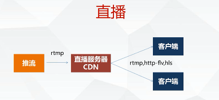

rtmp 延时一般 1-3 秒

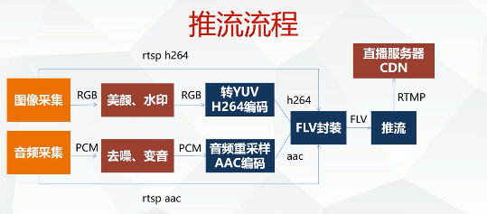

### 1.2 直播 rtmp 协议分析

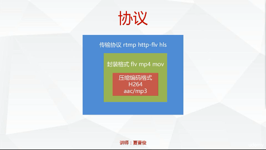

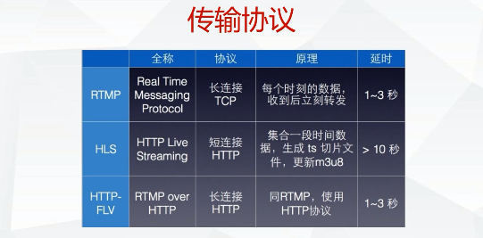

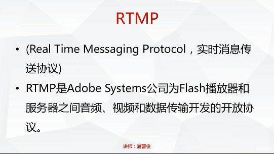

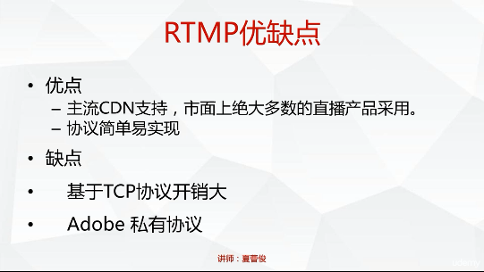

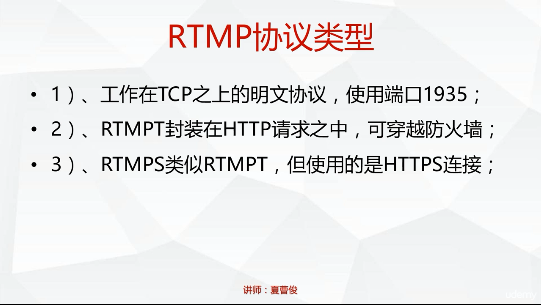

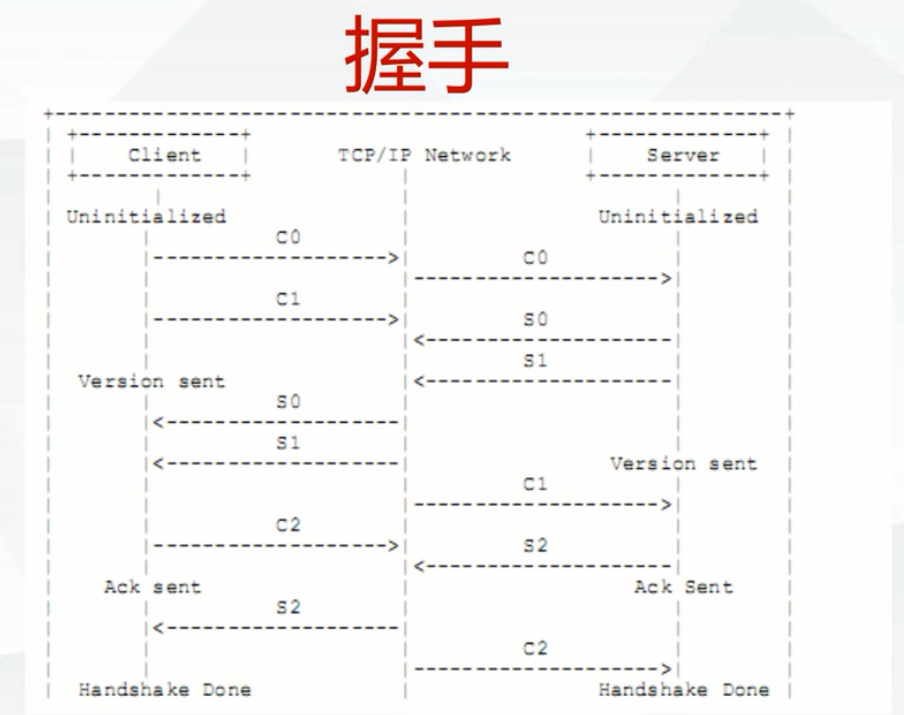

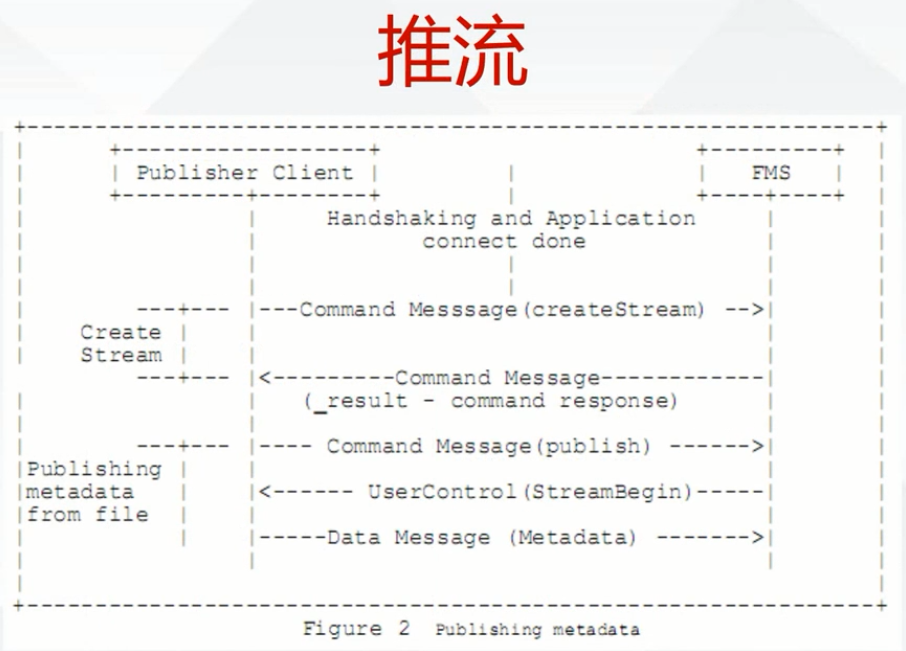

## 2. 直播服务器讲解和配置

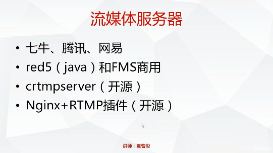

### 2.1 直播服务器介绍 crtmpserver 编译运行

```shell
$ apt-get install wget cmake
$ apt-get install libssl-dev
$ wget  https://codeload.github.com/j0sh/crtmpserver/zip/centosinit --no-check-certificate
$ unzip centosinit
$ cd builders/cmake
$ cmake . 
$ make
$ ./crtmpserver/crtmpserver ./crtmpserver/crtmpserver.lua

#
$ ffmpeg  -i test.flv  -f flv rtmp://192.168.1.44/live

#ʹc rtmp://192.168.1.44/live
#ʹplay ffplay rtmp://192.168.1.44/live  -fflags nobuffer
```

```shell
# error
CMake Error at cmake_find_modules/Find_openssl.cmake:99 (MESSAGE):
  Looking for openssl headers - not found
Call Stack (most recent call first):
  CMakeLists.txt:46 (INCLUDE)
$ cmake -DOPENSSL_ROOT_DIR=/usr/local/opt/openssl -DOPENSSL_LIBRARIES=/usr/local/opt/openssl/lib
```

### 2.2 下载 ffmpeg 工具推流并使用功能 vlc 拉流播放测试

```shell
$ wget https://nginx.org/download/nginx-1.16.0.tar.gz --no-check-certificate
$ git clone https://github.com/arut/nginx-rtmp-module.git
$ ./configure --add-module=/home/miaopei/workdir/test/ffmpet-test/nginx/nginx-rtmp-module 
$ make
$ make install
```


```shell
# nginx.conf 配置
rtmp {
    server {
        listen 1935;
        chunk_size 4096;
        application live {
            live on;
        }
    }
}
```

```shell
# 推流命令
$ ffmpeg -i test.mp4 -c copy -f flv rtmp://192.168.2.76/live
```

```shell
# 网页查看推流的状态
server {
    listen 8080;
    location /stat{
        rtmp_stat all;
        rtmp_stat_stylesheet stat.xsl;
    }
    location /stat.xsl{
        root /home/miaopei/workdir/test/ffmpet-test/nginx/nginx-rtmp-module;
    }
}
```

```shell
Reload config:
 $ nginx -s reload
Reopen Logfile:
 $ nginx -s reopen
Stop process:
 $ nginx -s stop
Waiting on exit process
 $ nginx -s quit
```

## 3. FFMpeg SDK 解封和推流

### 3.1 ffmpeg SDK开发环境准备

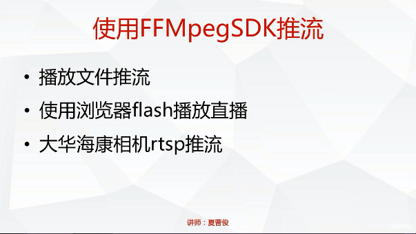

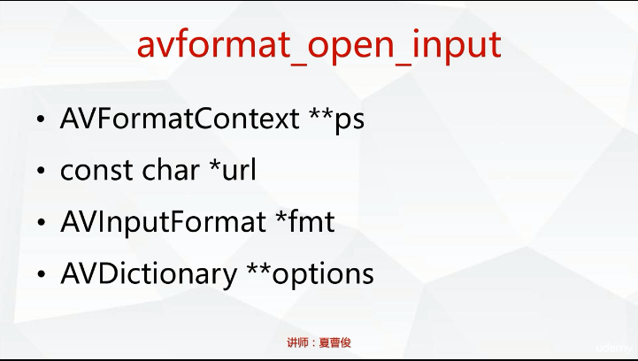

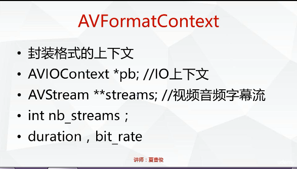

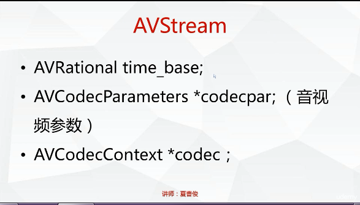

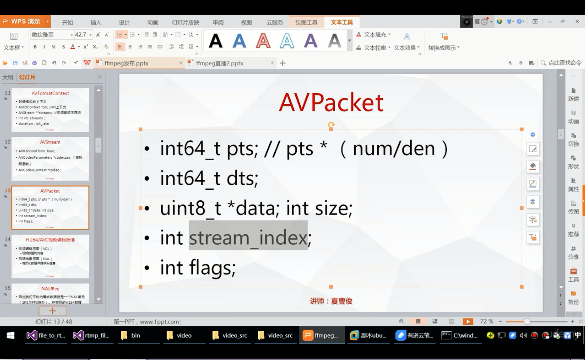

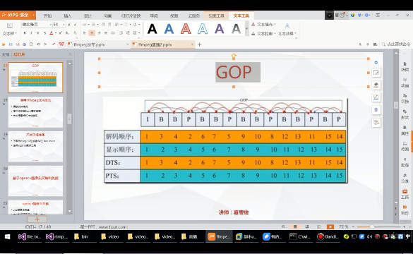

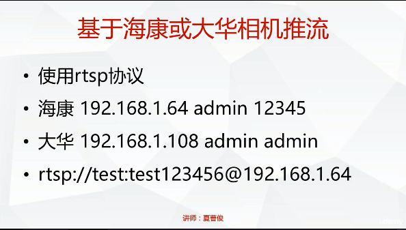


## 4. OpencvSDK 基础

> [Mac源码安装使用OpenCV](<https://blog.csdn.net/u010164190/article/details/79108608>)
>
> [在MacOS 10.13.2 下编译 OpenCV3.4.0 + OpenCV Contrib 3.4.0 成 Java 库](<https://blog.csdn.net/marksim/article/details/79146346>)
>
> [在MacOS上安装OpenCV 3.4(c++)](<https://www.jianshu.com/p/a36d41241ae8>)

OpenCV 源码编译：

```shell
# 下载 OpenCV 3.4.0
$ 
# 解压，进入到 opencv-3.4.0 目录下
$ mkdir -p build/install
$ cd build
$ cmake -G "Unix Makefiles" -j8 -D CMAKE_BUILD_TYPE=RELEASE -D CMAKE_INSTALL_PREFIX=/Users/miaopei/install/opencv/opencv-3.4.0/build/install ../
$ make -j8
$ make install
# 配置环境变量
PKG_CONFIG_PATH=$PKG_CONFIG_PATH:Users/miaopei/install/opencv/opencv-3.4.0/lib/pkgconfig
export PKG_CONFIG_PATH
export LD_LIBRARY_PATH=Users/miaopei/install/opencv/opencv-3.4.0/bin:SLD_LIBRARY_PATH
export PATH=${PATH}:Users/miaopei/install/opencv/opencv-3.4.0/lib
# 测试demo,打印当前版本号
#include <opencv2/core/utility.hpp>
#include <iostream>
int main(int argc, const char* argv[]){
  std::cout << "Welcome to OpenCV " << CV_VERSION << std::endl; 
  return 0;
}
# Makefile
CXX ?= g++
CXXFLAGS += -c -Wall $(shell pkg-config --cflags opencv)
LDFLAGS += $(shell pkg-config --libs --static opencv)
all: test_version
opencv_example: test_version.o; $(CXX) $< -o $@ $(LDFLAGS)
%.o: %.cpp; $(CXX) $< -o $@ $(CXXFLAGS)
clean: ; rm -f test_version.o test_version
```


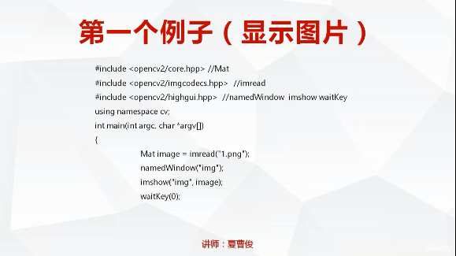

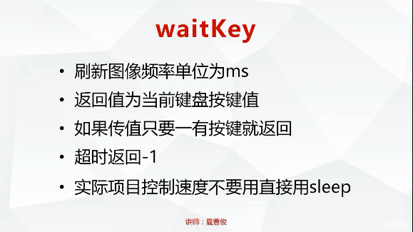


## 5. 视频采集编码推流和类封装


## 6. 音频录制编码推流和类封装


## 7. 音视频同步编码推流处理


## 8. XRtmpStreamer 项目完成（界面和美颜）


## 9. 补充

### 9.0 流媒体协议介绍（rtp/rtcp/rtsp/rtmp/mms/hls）

**1. RTP**：

> 参考文档 RFC3550/RFC3551

(Real-time Transport Protocol) 是用于 Internet 上针对多媒体数据流的一种传输层协议。RTP 协议详细说明了在互联网上传递音频和视频的标准数据包格式。RTP 协议常用于流媒体系统（配合 RTCP协议），视频会议和一键通（Push to Talk）系统（配合 H.323 或 SIP），使它成为 IP 电话产业的技术基础。**RTP 协议和 RTP 控制协议 RTCP 一起使用**，而且它是建立在 **UDP** 协议上的。

**RTP 本身并没有提供按时发送机制或其它服务质量（QoS）保证**，它依赖于低层服务去实现这一过程。 RTP 并不保证传送或防止无序传送，也不确定底层网络的可靠性。 RTP 实行有序传送， RTP 中的序列号允许接收方重组发送方的包序列，同时序列号也能用于决定适当的包位置，例如：在视频解码中，就不需要顺序解码。

**RTP 由两个紧密链接部分组成**： 

- RTP ― 传送具有实时属性的数据；
- RTP 控制协议（RTCP） ― 监控服务质量并传送正在进行的会话参与者的相关信息。

**2. RTCP**

实时传输控制协议（Real-time Transport Control Protocol 或 RTP Control Protocol 或简写 RTCP）是实时传输协议（RTP）的一个姐妹协议。RTCP 为 RTP 媒体流提供信道外（out-of-band）控制。**RTCP 本身并不传输数据，但和 RTP 一起协作将多媒体数据打包和发送**。RTCP 定期在流多媒体会话参加者之间传输控制数据。RTCP 的主要功能是为 RTP 所提供的服务质量（Quality of Service）提供反馈。

RTCP 收集相关媒体连接的统计信息，例如：传输字节数，传输分组数，丢失分组数，jitter，单向和双向网络延迟等等。网络应用程序可以利用 RTCP 所提供的信息试图提高服务质量，比如限制信息流量或改用压缩比较小的编解码器。RTCP 本身不提供数据加密或身份认证。SRTCP 可以用于此类用途。

**3. SRTP & SRTCP**

> 参考文档 RFC3711

安全实时传输协议（Secure Real-time Transport Protocol 或 SRTP）是在实时传输协议（Real-time Transport Protocol 或 RTP）基础上所定义的一个协议，**旨在为单播和多播应用程序中的实时传输协议的数据提供加密、消息认证、完整性保证和重放保护**。它是由 David Oran（思科）和 Rolf Blom（爱立信）开发的，并最早由 IETF 于 2004年3月作为 RFC3711 发布。

由于实时传输协议和可以被用来控制实时传输协议的会话的实时传输控制协议（RTP Control Protocol 或 RTCP）有着紧密的联系，安全实时传输协议同样也有一个伴生协议，它被称为安全实时传输控制协议（Secure RTCP 或 SRTCP）；安全实时传输控制协议为实时传输控制协议提供类似的与安全有关的特性，就像安全实时传输协议为实时传输协议提供的那些一样。

在使用实时传输协议或实时传输控制协议时，使不使用安全实时传输协议或安全实时传输控制协议是可选的；但即使使用了安全实时传输协议或安全实时传输控制协议，所有它们提供的特性（如加密和认证）也都是可选的，这些特性可以被独立地使用或禁用。唯一的例外是在使用安全实时传输控制协议时，必须要用到其消息认证特性。

**4. RTSP**

> 参考文档 RFC2326

是由 Real Networks 和 Netscape 共同提出的。该协议定义了一对多应用程序如何有效地通过 IP 网络传送多媒体数据。RTSP 提供了一个可扩展框架，使实时数据，如音频与视频的受控、点播成为可能。数据源包括现场数据与存储在剪辑中的数据。**该协议目的在于控制多个数据发送连接，为选择发送通道，如UDP、多播UDP与TCP提供途径，并为选择基于RTP上发送机制提供方法**。

RTSP（Real Time Streaming Protocol）是用来控制声音或影像的多媒体串流协议，并允许同时多个串流需求控制，传输时所用的网络通讯协定并不在其定义的范围内，服务器端可以自行选择使用 TCP 或 UDP来传送串流内容，它的语法和运作跟 HTTP 1.1 类似，**但并不特别强调时间同步，所以比较能容忍网络延迟**。而前面提到的允许同时多个串流需求控制（Multicast），除了可以降低服务器端的网络用量，更进而支持多方视讯会议（Video Conference）。 因为与 HTTP1.1 的运作方式相似，所以代理服务器《Proxy》的快取功能《Cache》也同样适用于 RTSP，并因 RTSP 具有重新导向功能，可视实际负载情况来转换提供服务的服务器，以避免过大的负载集中于同一服务器而造成延迟。

**5. RTSP 和 RTP 的关系**

RTP 不象 http 和 ftp 可完整的下载整个影视文件，它是以固定的数据率在网络上发送数据，客户端也是按照这种速度观看影视文件，当影视画面播放过后，就不可以再重复播放，除非重新向服务器端要求数据。

RTSP 与 RTP 最大的区别在于：RTSP 是一种双向实时数据传输协议，它允许客户端向服务器端发送请求，如回放、快进、倒退等操作。当然，RTSP 可基于 RTP 来传送数据，还可以选择 TCP、UDP、组播 UDP 等通道来发送数据，具有很好的扩展性。它是一种类似与 http 协议的网络应用层协议。目前碰到的一个应用：服务器端实时采集、编码并发送两路视频，客户端接收并显示两路视频。由于客户端不必对视频数据做任何回放、倒退等操作，可直接采用 UDP + RTP + 组播实现。

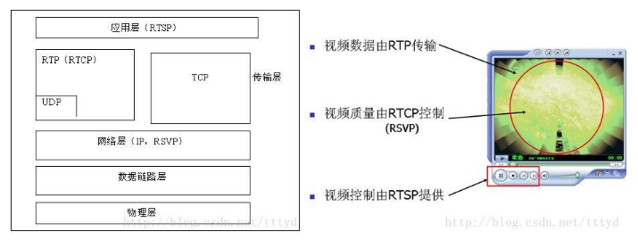

RTP：实时传输协议（Real-time Transport Protocol） 

- RTP/RTCP 是实际传输数据的协议 

- RTP 传输音频/视频数据，如果是 PLAY，Server 发送到 Client 端，如果是 RECORD，可以由Client 发送到 Server 

- 整个 RTP 协议由两个密切相关的部分组成：
  - RTP数据协议
  - RTP控制协议（即RTCP） 

RTSP：实时流协议（Real Time Streaming Protocol，RTSP） 

- RTSP 的请求主要有 DESCRIBE, SETUP, PLAY, PAUSE, TEARDOWN, OPTIONS 等，顾名思义可以知道起对话和控制作用 

- RTSP 的对话过程中 SETUP 可以确定 RTP/RTCP 使用的端口，PLAY/PAUSE/TEARDOWN 可以开始或者停止 RTP 的发送，等等 

RTCP： 

- RTCP 包括 Sender Report 和 Receiver Report，用来进行音频/视频的同步以及其他用途，是一种控制协议

**6. SDP**

会话描述协议（SDP）为会话通知、会话邀请和其它形式的多媒体会话初始化等目的提供了多媒体会话描述。

会话目录用于协助多媒体会议的通告，并为会话参与者传送相关设置信息。SDP 即用于将这种信息传输到接收端。**SDP 完全是一种会话描述格式 ― 它不属于传输协议 ― 它只使用不同的适当的传输协议，包括会话通知协议（SAP）、会话初始协议（SIP）、实时流协议（RTSP）、MIME 扩展协议的电子邮件以及超文本传输协议（HTTP）**。

SDP 的设计宗旨是通用性，它可以应用于大范围的网络环境和应用程序，而不仅仅局限于组播会话目录，**但 SDP 不支持会话内容或媒体编码的协商**。

在因特网组播骨干网（Mbone）中，会话目录工具被用于通告多媒体会议，并为参与者传送会议地址和参与者所需的会议特定工具信息，这由 SDP 完成。SDP 连接好会话后，传送足够的信息给会话参与者。SDP 信息发送利用了会话通知协议（SAP），它周期性地组播通知数据包到已知组播地址和端口处。这些信息是 UDP 数据包，其中包含 SAP 协议头和文本有效载荷（text payload）。这里文本有效载荷指的是 SDP 会话描述。此外信息也可以通过电子邮件或 WWW （World Wide Web） 进行发送。

**SDP 文本信息包括**：

- 会话名称和意图；
- 会话持续时间；
- 构成会话的媒体；
- 有关接收媒体的信息（地址等）。
- 协议结构

**SDP 信息是文本信息，采用 UTF-8 编 码中的 ISO 10646 字符集。SDP 会话描述如下：（标注 * 符号的表示可选字段）**：

```shell
v = （协议版本）
o = （所有者/创建者和会话标识符）
s = （会话名称）
i = * （会话信息）
u = * （URI 描述）
e = * （Email 地址）
p = * （电话号码）
c = * （连接信息 ― 如果包含在所有媒体中，则不需要该字段）
b = * （带宽信息）
```

一个或更多时间描述（如下所示）：

```shell
z = * （时间区域调整）
k = * （加密密钥）
a = * （0 个或多个会话属性行）
```

0个或多个媒体描述（如下所示）

时间描述

```shell
t = （会话活动时间）
r = * （0或多次重复次数）
```

媒体描述

```shell
m = （媒体名称和传输地址）
i = * （媒体标题）
c = * （连接信息 — 如果包含在会话层则该字段可选）
b = * （带宽信息）
k = * （加密密钥）
a = * （0 个或多个会话属性行）
```

**7. RTMP/RTMPS**

RTMP(Real Time Messaging Protocol) 实时消息传送协议是 Adobe Systems 公司为 Flash 播放器和服务器之间音频、视频和数据传输 开发的开放协议。

它有三种变种：

> 1) 工作在 TCP 之上的明文协议，使用端口1935；
>
> 2) RTMPT 封装在 HTTP 请求之中，可穿越防火墙；
>
> 3) RTMPS 类似 RTMPT，但使用的是 HTTPS 连接；

RTMP 协议(Real Time Messaging Protocol)是被 Flash 用于对象, 视频, 音频的传输. **这个协议建立在 TCP 协议或者轮询 HTTP 协议之上**.

RTMP 协议就像一个用来装数据包的容器, 这些数据既可以是 AMF 格式的数据,也可以是 FLV 中的视/音频数据. 一个单一的连接可以通过不同的通道传输多路网络流. 这些通道中的包都是按照固定大小的包传输的.

**8. mms**

MMS (Microsoft Media Server Protocol)，中文“微软媒体服务器协议”，用来访问并流式接收 Windows Media 服务器中 `.asf` 文件的一种协议。MMS 协议用于访问 Windows Media 发布点上的单播内容。MMS 是连接 Windows Media 单播服务的默认方法。若观众在 Windows Media Player 中键入一个 URL 以连接内容，而不是通过超级链接访问内容，则他们必须使用MMS 协议引用该流。MMS的预设埠（端口）是1755

当使用 MMS 协议连接到发布点时，使用协议翻转以获得最佳连接。“协议翻转”始于试图通过 MMSU 连接客户端。 MMSU 是 MMS 协议结合 UDP 数据传送。如果 MMSU 连接不成功，则服务器试图使用 MMST。MMST 是 MMS 协议结合 TCP 数据传送。

如果连接到编入索引的 `.asf` 文件，想要快进、后退、暂停、开始和停止流，则必须使用 MMS。不能用 UNC 路径快进或后退。若您从独立的 Windows Media Player 连接到发布点，则必须指定单播内容的 URL。若内容在主发布点点播发布，则 URL 由服务器名和 `.asf` 文件名组成。例如：`mms://windows_media_server/sample.asf`。其中 windows_media_server 是 Windows Media 服务器名，sample.asf 是您想要使之转化为流的 `.asf` 文件名。

若您有实时内容要通过广播单播发布，则该 URL 由服务器名和发布点别名组成。例如：`mms://windows_media_server/LiveEvents`。这里 windows_media_server 是 Windows Media 服务器名，而 LiveEvents 是发布点名

**9. HLS**

HTTP Live Streaming（HLS）是苹果公司(Apple Inc.)实现的基于HTTP的流媒体传输协议，可实现流媒体的直播和点播，主要应用在 iOS 系统，为 iOS 设备（如iPhone、iPad）提供音视频直播和点播方案。HLS 点播，基本上就是常见的分段 HTTP 点播，不同在于，它的分段非常小。

相对于常见的流媒体直播协议，例如 RTMP协议、RTSP协议、MMS协议等，HLS直播最大的不同在于，直播客户端获取到的，并不是一个完整的数据流。HLS 协议在服务器端将直播数据流存储为连续的、很短时长的媒体文件（MPEG-TS格式），而客户端则不断的下载并播放这些小文件，因为服务器端总是会将最新的直播数据生成新的小文件，这样客户端只要不停的按顺序播放从服务器获取到的文件，就实现了直播。由此可见，基本上可以认为，**HLS 是以点播的技术方式来实现直播**。由于数据通过 HTTP 协议传输，所以完全不用考虑防火墙或者代理的问题，而且分段文件的时长很短，客户端可以很快的选择和切换码率，以适应不同带宽条件下的播放。不过 HLS 的这种技术特点，决定了它的延迟一般总是会高于普通的流媒体直播协议。　

根据以上的了解要实现 HTTP Live Streaming 直播，需要研究并实现以下技术关键点：

- 采集视频源和音频源的数据
- 对原始数据进行H264编码和AAC编码
- 视频和音频数据封装为MPEG-TS包
- HLS分段生成策略及m3u8索引文件
- HTTP传输协议

### 9.1 HLS，RTSP，RTMP的区别

- HLS （ HTTP Live Streaming）苹果公司提出的流媒体协议，直接把流媒体切片成一段段，信息保存到m3u列表文件中，可以将不同速率的版本切成相应的片；播放器可以直接使用http协议请求流数据，可以在不同速率的版本间自由切换，实现无缝播放；省去使用其他协议的烦恼。缺点是延迟大小受切片大小影响，不适合直播，适合视频点播。

- RTSP （Real-Time Stream Protocol）由Real Networks 和 Netscape共同提出的，基于文本的多媒体播放控制协议。RTSP定义流格式，流数据经由RTP传输；RTSP实时效果非常好，适合视频聊天，视频监控等方向。

- RTMP（Real Time Message Protocol） 有 Adobe 公司提出，用来解决多媒体数据传输流的多路复用（Multiplexing）和分包（packetizing）的问题，优势在于低延迟，稳定性高，支持所有摄像头格式，浏览器加载 flash插件就可以直接播放。

总结：HLS 延迟大，适合视频点播；RTSP虽然实时性最好，但是实现复杂，适合视频聊天和视频监控；RTMP强在浏览器支持好，加载flash插件后就能直接播放，所以非常火，相反在浏览器里播放rtsp就很困难了。

### 9.2 RTSP、RTCP、RTP区别

**1：RTSP实时流协议**

作为一个应用层协议，RTSP提供了一个可供扩展的框架，它的意义在于使得实时流媒体数据的受控和点播变得可能。总的说来，RTSP是一个流媒体表示 协议，主要用来控制具有实时特性的数据发送，但它本身并不传输数据，而是必须依赖于下层传输协议所提供的某些服务。RTSP可以对流媒体提供诸如播放、暂 停、快进等操作，它负责定义具体的控制消息、操作方法、状态码等，此外还描述了与RTP间的交互操作（RFC2326）。

**2：RTCP控制协议**

RTCP控制协议需要与RTP数据协议一起配合使用，当应用程序启动一个RTP会话时将同时占用两个端口，分别供RTP和RTCP使用。RTP本身并 不能为按序传输数据包提供可靠的保证，也不提供流量控制和拥塞控制，这些都由RTCP来负责完成。通常RTCP会采用与RTP相同的分发机制，向会话中的 所有成员周期性地发送控制信息，应用程序通过接收这些数据，从中获取会话参与者的相关资料，以及网络状况、分组丢失概率等反馈信息，从而能够对服务质量进 行控制或者对网络状况进行诊断。

RTCP协议的功能是通过不同的RTCP数据报来实现的，主要有如下几种类型：

- SR：发送端报告，所谓发送端是指发出RTP数据报的应用程序或者终端，发送端同时也可以是接收端。(SERVER定时间发送给CLIENT)。

- RR：接收端报告，所谓接收端是指仅接收但不发送RTP数据报的应用程序或者终端。(SERVER接收CLIENT端发送过来的响应)。

- SDES：源描述，主要功能是作为会话成员有关标识信息的载体，如用户名、邮件地址、电话号码等，此外还具有向会话成员传达会话控制信息的功能。

- BYE：通知离开，主要功能是指示某一个或者几个源不再有效，即通知会话中的其他成员自己将退出会话。

- APP：由应用程序自己定义，解决了RTCP的扩展性问题，并且为协议的实现者提供了很大的灵活性。

**3：RTP数据协议**

RTP数据协议负责对流媒体数据进行封包并实现媒体流的实时传输，每一个RTP数据报都由头部（Header）和负载（Payload）两个部分组成，其中头部前12个字节的含义是固定的，而负载则可以是音频或者视频数据。

RTP用到的地方就是 PLAY ，服务器往客户端传输数据用UDP协议，RTP是在传输数据的前面加了个12字节的头(描述信息)。

RTP载荷封装设计本文的网络传输是基于IP协议，所以最大传输单元(MTU)最大为1500字节，在使用IP／UDP／RTP的协议层次结构的时候，这 其中包括至少20字节的IP头，8字节的UDP头，以及12字节的RTP头。这样，头信息至少要占用40个字节，那么RTP载荷的最大尺寸为1460字 节。以H264 为例，如果一帧数据大于1460，则需要分片打包，然后到接收端再拆包，组合成一帧数据，进行解码播放。

### 9.3 RTSP、 RTMP、HTTP的共同点、区别

共同点：

- RTSP RTMP HTTP都是在应用应用层。
- 理论上RTSP RTMPHTTP都可以做直播和点播，但一般做直播用RTSP RTMP，做点播用HTTP。做视频会议的时候原来用SIP协议，现在基本上被RTMP协议取代了。

区别：

- HTTP: 即超文本传送协议(ftp即文件传输协议)。

  - HTTP:（Real Time Streaming Protocol），实时流传输协议。

  - HTTP全称Routing Table Maintenance Protocol（路由选择表维护协议）。

- HTTP将所有的数据作为文件做处理。http协议不是流媒体协议。

  - RTMP 和 RTSP协议是流媒体协议。

- RTMP协议是Adobe的私有协议,未完全公开，RTSP协议和HTTP协议是共有协议，并有专门机构做维护。

- RTMP协议一般传输的是flv，f4v格式流，RTSP协议一般传输的是ts,mp4格式的流。HTTP没有特定的流。

- RTSP传输一般需要2-3个通道，命令和数据通道分离，HTTP和RTMP一般在TCP一个通道上传输命令和数据。


