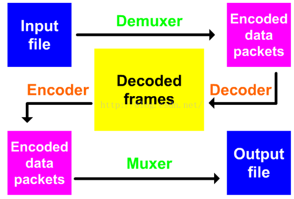
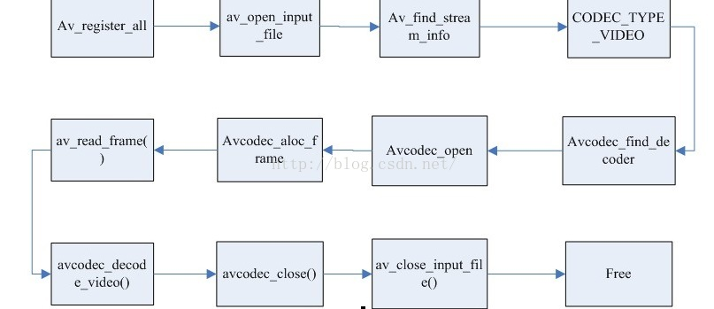

> [ffmpeg编程基础和一些常见问题的解答](<https://blog.csdn.net/u010317005/article/details/51083745>)

## FFMpeg 编程的大致框架



**进一步的详解，具体到函数调用级别**



详细步骤：

- 注册所有容器格式和 `CODEC:av_register_all(）`
- 打开文件: `av_open_input_file()`
- 从文件中提取流信息 : `av_find_stream_info()`
- 穷举所有的流，查找其中种类为 `CODEC_TYPE_VIDEO`
- 查找对应的解码器 : `avcodec_find_decoder()`
- 打开编解码器 : `avcodec_open()`
- 为解码帧分配内存 : `avcodec_alloc_frame()`

- 不停地从码流中提取出帧数据 : `av_read_frame()`
- 判断帧的类型，对于视频帧调用 : `avcodec_decode_video()`
- 解码完后，释放解码器 : `avcodec_close()`
- 关闭输入文件 : `av_close_input_file()`

首先第一件事情就是**开一个视频文件并从中得到流**。

我们要做的第一件事情就是**使用** `av_register_all()` ;来初始化 `libavformat/libavcodec` :

这一步注册库中含有的所有可用的文件格式和编码器，这样当打开一个文件时，它们才能够自动选择相应的文件格式和编码器。`av_register_all()` 只需调用一次，所以，要放在初始化代码中。也可以仅仅注册个人的文件格式和编码。

下一步，**打开文件**：

```c++
AVFormatContext *pFormatCtx;
const char      *filename = "myvideo.mpg";
av_open_input_file(&pFormatCtx, filename, NULL, 0, NULL)；   // 打开视频文件
```

最后三个参数描述了文件格式，缓冲区大小（*size*）和格式参数；我们通过简单地指明*NULL*或*0*告诉 `libavformat` 去自动探测文件格式并且使用默认的缓冲区大小。这里的格式参数指的是视频输出参数，比如宽高的坐标。

下一步，我们需要**取出包含在文件中的流信息**：

```c++
av_find_stream_info(pFormatCtx)；  // 取出流信息
dump_format(pFormatCtx, 0, filename, false);  //我们可以使用这个函数把获取到得参数全部输出。
for(i=0; i<pFormatCtx->nb_streams; i++)  //区分视频流和音频流
if(pFormatCtx->streams->codec.codec_type == CODEC_TYPE_VIDEO) //找到视频流，这里也可以换成音频
{
   videoStream = i;
   break;
}
```

接下来就需要**寻找解码器**

```c++
AVCodec *pCodec;
pCodec = avcodec_find_decoder(pCodecCtx->codec_id);
avcodec_open(pCodecCtx, pCodec)；    // 打开解码器
```

**给视频帧分配空间以便存储解码后的图片**：

```c++
AVFrame *pFrame;
pFrame = avcodec_alloc_frame();
```

**////////////////////////////////////////开始解码///////////////////////////////////////////**

第一步当然是**读数据**：

我们将要做的是通过读取包来读取整个视频流，然后把它解码成帧，最后转换格式并且保存。

```c++
while(av_read_frame(pFormatCtx, &packet)>=0) {  //读数据
	if(packet.stream_index==videoStream){      //判断是否视频流
		avcodec_decode_video(pCodecCtx, pFrame, &frameFinished, packet.data, packet.size);   //解码
    }  
	if(frameFinished) {
		img_convert((AVPicture *)pFrameRGB, PIX_FMT_RGB24,(AVPicture*)pFrame, pCodecCtx->pix_fmt, pCodecCtx->width, pCodecCtx-          >height);	 //转换   
	}
	SaveFrame(pFrameRGB, pCodecCtx->width, pCodecCtx->height, i); //保存数据
	av_free_packet(&packet);  //释放
}
```

`av_read_frame()` 读取一个包并且把它保存到 `AVPacket` 结构体中。这些数据可以在后面通过 `av_free_packet()` 来释放。函数 `avcodec_decode_video()` 把包转换为帧。然而当解码一个包的时候，我们可能没有得到我们需要的关于帧的信息。因此，当我们得到下一帧的时候， `avcodec_decode_video()` 为我们设置了帧结束标志 `frameFinished`。最后，我们使用  `img_convert()` 函数来把帧从原始格式（`pCodecCtx->pix_fmt`）转换成为 `RGB` 格式。要记住，你可以把一个 `AVFrame` 结构体的指针转换为 `AVPicture` 结构体的指针。最后，我们把帧和高度宽度信息传递给我们的 `SaveFrame` 函数。

到此解码完毕，显示过程使用 `SDL` 完成考虑到我们以后会使用 `firmware` 进行显示操作，`SDL` 忽略不讲。

## 音视频同步

***DTS*（解码时间戳）和 *PTS*（显示时间戳）**

当我们调用 `av_read_frame()` 得到一个包的时候，***PTS*** 和 ***DTS*** 的信息也会保存在包中。但是我们真正想要的 ***PTS*** 是我们刚刚解码出来的原始帧的 ***PTS***，这样我们才能知道什么时候来显示它。然而，我们从 `avcodec_decode_video()` 函数中得到的帧只是一个 `AVFrame`，其中并没有包含有用的 ***PTS*** 值（注意：`AVFrame` 并没有包含时间戳信息，但当我们等到帧的时候并不是我们想要的样子）。

我们保存一帧的第一个包的 ***PTS***：这将作为整个这一帧的 ***PTS***。我们可以通过函数 `avcodec_decode_video()` 来计算出哪个包是一帧的第一个包。

怎样实现呢？任何时候当一个包开始一帧的时候，`avcodec_decode_video()` 将调用一个函数来为一帧申请一个缓冲。当然，`ffmpeg` 允许我们重新定义那个分配内存的函数。计算前一帧和现在这一帧的时间戳来预测出下一个时间戳的时间。同时，我们需要同步视频到音频。我们将设置一个音频时间 `audioclock`；一个内部值记录了我们正在播放的音频的位置。就像从任意的 *mp3* 播放器中读出来的数字一样。既然我们把视频同步到音频，视频线程使用这个值来算出是否太快还是太慢。

**用 FFMPEG SDK 进行视频转码压缩时解决音视频不同步问题的方法:**

用 *FFMPEG SDK* 进行视频转码压缩的时候，转码成功后去看视频的内容，发现音视频是不同步的。这个的确是一个恼火的事情。我在用 *FFMPEG SDK* 做 *h264* 格式的 *FLV* 文件编码 *Filter* 的时候就碰到了这个问题。

经过研究发现，*FFMPEG SDK* 写入视频的时候有两个地方用来控制写入的时间戳，一个是 `AvPacket` 一个是 `AvFrame` 。在调用 `avcodec_encode_video` 的时候需要传入 `AvFrame` 的对象指针，也就是传入一帧未压缩的视频进行压缩处理，`AvFrame` 包含一个 ***pts*** 的参数，这个参数就是当前帧将来在还原播放的时候的时间戳。而 `AvPacket` 里面也有 ***pts***，还有 ***dts***。说起这个就必须要说明一下 `I , P , B` 三种视频压缩帧。`I` 帧就是关键帧，不依赖于其他视频帧，`P` 帧是向前预测的帧，只依赖于前面的视频帧，而 `B` 帧是双向预测视频帧，依赖于前后视频帧。由于 `B` 帧的存在，因为它是双向的，必须知道前面的视频帧和后面的视频帧的详细内容后，才能知道本 `B` 帧最终该呈现什么图像。而 ***pts*** 和 ***dts*** 两个参数就是用来控制视频帧的显示和解码的顺序。

***pts*** 就是帧显示的顺序。***dts*** 就是帧被读取进行解码的顺序。如果没有 `B` 帧存在，***dts*** 和 ***pts*** 是相同的。反之，则是不相同的。关于这个的详细介绍可以参考一下 *mpeg* 的原理。

**AvPacket 包含的 pts 和 dts 两个到底该设置什么值？**

***pts*** 和 ***dts*** 需要设置的就是视频帧解码和显示的顺序。每增加一帧就加一，并不是播放视频的时间戳。但是实践证明经过 *rmvb* 解码的视频有时候并不是固定帧率的，而是变帧率的，这样，如果每压缩一帧，***pts*** 和 ***dts*** 加一的方案为导致音视频不同步。

**那怎么来解决音视频同步的问题呢？**

请看如下代码段。

`lTimeStamp` 是通过 `directshow` 获取的当前的视频帧的时间戳。`m_llframe_index` 为当前已经经过压缩处理的帧的数量。

首先 `av_rescale` 计算得到当前压缩处理已经需要处理什么时间戳的视频帧，如果该时间戳尚未到达 `directshow` 当前提供的视频帧的时间戳，则将该帧丢弃掉。

否则进行压缩操作。并设置 `AVPacket` 的 ***pts*** 和 ***dts***。这里假设 `B` 帧不存在。

因为在将来播放的时候视频以我们设定的固定播放帧率进行播放，所以需要根据设定的播放帧率计算得到的视频帧时间戳和 `directshow` 提供的当前视频帧的时间戳进行比较，设定是否需要进行实施延缓播放的策略。如果需要延缓播放，则将 ***pts*** 增加步长 `2`，否则以普通速度播放，则设置为 `1.dts` 与之相同。

```c++
__int64 x =av_rescale(m_llframe_index,AV_TIME_BASE*(int64_t)c->time_base.num,c->time_base.den);
 
if( x > lTimeStamp ){
    return TRUE;
}
m_pVideoFrame2->pts = lTimeStamp;
m_pVideoFrame2->pict_type = 0;
 
int out_size = avcodec_encode_video( c, m_pvideo_outbuf, video_outbuf_size,m_pVideoFrame2 );
/* if zero size, it means the image was buffered */
if (out_size > 0){
      AVPacket pkt;
      av_init_packet(&pkt);
}
if( x > lTimeStamp )
{
   pkt.pts = pkt.dts = m_llframe_index;
   pkt.duration = 0;
} else{
   pkt.duration = (lTimeStamp - x)*c->time_base.den/1000000 + 1;
   pkt.pts = m_llframe_index;
   pkt.dts = pkt.pts;
   m_llframe_index += pkt.duration;
}
 
//pkt.pts = lTimeStamp * (__int64)frame_rate.den / 1000;
if( c->coded_frame && c->coded_frame->key_frame ){
    pkt.flags |= PKT_FLAG_KEY;
}
 
pkt.stream_index= m_pVideoStream->index;
pkt.data= m_pvideo_outbuf;
pkt.size= out_size;
 
/* write the compressed frame in the media file */
ret = av_interleaved_write_frame( m_pAvFormatContext, &pkt );
}
else
{
    ret = 0;
}
```

**avcodec_decode_video 解码的帧为什么后面的比前面的 pts 小呢？**

请问如下代码：

```c++
while( av_read_frame(pFormatCtxSource,&packet)>=0 )
{
    if( packet.stream_index == videoStream ){
        int out_size = avcodec_decode_video(pCodecCtxSource, pFrameSource, &bFrameFinished, packet.data, packet.size);
        if( bFrameFinished ){
            pFrameSource->pts = av_rescale_q(packet.pts, pCodecCtxSource->time_base, pStCodec->time_base);
            int out_size = avcodec_encode_video(pStCodec, video_buffer, 200000, pFrameSource); // Encodeto output
            if( out_size>0 ){
                // ...
            }
        }
    }
    av_free_packet(&packet);
}
```

在我*Decode*的时候，第一帧得到的 *pFrameSource->pts* 是*96*，再解第二帧的时候，*pFrameSource->pts*计算完后就成了*80*几，后几帧也是比*96*小，过一会又会解出来一个*100*多的，接下来又是比*100*多小的，这是为什么？在*Encode*的时候，先*Encode*一个*pts=96*的，再去*Encode*比*96*小的帧就返回*-1*了，直到找到一个比*96*大的。

**理解：**

*Decoder*后*output*的*pts*是按正常的顺序，即显示的顺序输出的，如果有*B*帧，*decoder*会缓存。

但*encoder*后，输出的是按*dts*输出的。

*Pts,dts*并不是时间戳，而更应该理解为*frame*的顺序序列号。由于每帧*frame*的帧率并不一定是一致的，可能会变化的。转换为时间戳的话，应该是（*pts* 帧率）。为加深理解

可以将*pts*比做是第*pts*帧*frame*，假设每帧的帧率不变的话，则显示的时间戳为（*pts**帧率），如果考虑帧率变化的，则要想办法将（*pts 当前的帧率）累加到后面。

可以看出有的*pts*是*+1*累加，有的是加了很多，但都是按顺序累加的。当传人*decoder*前的*packet*有*pts*时，则*decoder*后获取的*frame*将会赋值*packet*的*pts*；当传人的*packet*只是一帧的部分数据或是*B*帧，由于*decoder*出来的*frame*要按正常的*pts*顺序输出，有可能*decoder*不会获取到*frame*，或*decoder*内部会缓存也不会输出*frame*，即*frame*的*pts*会为空。*Frame pts*（即*opaque*）为空的话则会看*frame->dts,dts*都没有的话才认为*frame->pts*为*0.*

对于：

```c++
pts *= av_q2d(is->video_st->time_base);  // 即pts帧率

// Did we get avideo frame?
if(frameFinished) {
	pts=synchronize_video(is, pFrame, pts);
```

*synchronize_video* 考虑了 3中情况：

*1.    pts* 拿到的话就用该*pts*

*2.    pts*没有拿到的话就用前一帧的*pts*时间

*3.*    如果该帧要重复显示，则将显示的`数量 * 帧率`，再加到前面的 *pts* 中。

```c++
if(queue_picture(is, pFrame, pts) < 0) {/////传人decoder后的帧队列中，以便后续去获取show。

static double synchronize_video(VideoState *is, AVFrame*src_frame, double pts) { 
  doubleframe_delay; 
  if(pts != 0) {
    /* if we havepts, set video clock to it */
    is->video_clock = pts;
  } else {
    /* if we aren'tgiven a pts, set it to the clock */
    pts =is->video_clock;
  }
  /* update thevideo clock */
   /////很关键：前面传进来的pts已经是时间戳了，是当前frame开始播放的时间戳，
   /////下面frame_delay是该帧显示完将要花费的时间，（pts+frame_delay）也即是/////预测的下一帧将要播放的时间戳。
  frame_delay =av_q2d(is->video_st->codec->time_base);
  /* if we arerepeating a frame, adjust clock accordingly */
 
  //////重复多帧的话要累加上
  frame_delay +=src_frame->repeat_pict * (frame_delay * 0.5);
  is->video_clock += frame_delay;
  return pts;/////此时返回的值即为下一帧将要开始显示的时间戳。
} 
///////开定时器去显示帧队列中的已经decode过的数据，按前面的分析我们已经知道帧队列中的数据已经是按pts顺序插入到队列中的。Timer的作用就是有帧率不一致及重复帧的情况造成时间戳不是线性的，有快有慢，从而tutorial5才有timer的方式来播放追赶
```

以下是一个网友很直观浅显的例子解释：

`if(packet->dts == AV_NOPTS_VALUE` 是不是就是没有获取到 *dts* 的情况？

就是有一把尺子一只蚂蚁跟着一个标杆走

标杆是匀速的蚂蚁或快或慢

慢了你就抽让他跑起来快了就拽它

这样音（标杆）视频（蚂蚁）就能同步了

这里最大的问题就是音频是匀速的视频是非线性的


另外：此时 *vp–>pts* 获取到的 *pts* 已经转化为时间戳了，这个时间戳为就是当前帧显示结束的时间戳，也即是下一帧将显示的预测时间戳。

```cpp
static void video_refresh_timer(void *userdata) {
  VideoState *is = (VideoState*)userdata;
  VideoPicture *vp;
  double actual_delay, delay,sync_threshold, ref_clock, diff;
 
  if(is->video_st) {
    if(is->pictq_size == 0) {
      schedule_refresh(is, 1);
    } else {
      vp =&is->pictq[is->pictq_rindex];
      delay = vp->pts -is->frame_last_pts; /* the pts from last time */  ////这是当前要显示的frame和下一副                                                        //////将要显示的frame的间隔时间
      if(delay <= 0 || delay>= 1.0) {
         /* if incorrect delay, useprevious one */
         delay =is->frame_last_delay;
      }
      /* save for next time */
      is->frame_last_delay =delay;
      is->frame_last_pts =vp->pts;
 
      /* update delay to sync toaudio */
      ref_clock = get_audio_clock(is);/////获取到声音当前播放的时间戳。
      diff = vp->pts -ref_clock;////// vp->pts实际上是预测的下一帧将要播放的开始时间,
 
      //也就是说在diff这段时间中声音是匀速发生的，但是在delay这段时间frame的显示可能就会有快//////////慢的区别。   
 
      /* Skip or repeat the frame.Take delay into account
          FFPlay still doesn't "know if this is thebest guess." */
      sync_threshold = (delay >AV_SYNC_THRESHOLD) ? delay : AV_SYNC_THRESHOLD;
        
      if(fabs(diff) < AV_NOSYNC_THRESHOLD) {
         if(diff <=-sync_threshold) {
           delay = 0;//////下一帧画面显示的时间和当前的声音很近的话加快显示下一帧（即后面video_display显示完当前帧后开启定时器很快          去显示下一帧）
         } else if(diff >=sync_threshold) {
           delay = 2 * delay;       //////下一帧开始显示的时间和当前声音的时间隔的比较长则延缓，即两帧画面间话的显示的时间长度大于两帧画面  间的声音播放的时间，则我们将两帧画显示的时候加倍拖长点，比如帧1和帧2的时间显示间隔为40ms，但帧1和帧2的声音播放时间为55ms，怎么办呢？我们不可能去打乱声音的质量的，则我们采用的方法是：将两帧画面的播放间隔加大，本来是过30ms就要开始播下一帧的，我们改成60ms后才播下一帧。
         }
      }///当然如果diff大于AV_NOSYNC_THRESHOLD，即快进的模式了，画面跳动太大，不存在音视频同步的问题了。
 
      is->frame_timer += delay;
      /* computer the REAL delay*/
      actual_delay =is->frame_timer - (av_gettime() / 1000000.0);
      if(actual_delay < 0.010){
         /* Really it should skipthe picture instead */
         actual_delay = 0.010;
      }
      schedule_refresh(is,(int)(actual_delay * 1000 + 0.5));////开定时器去显示下一帧
      /* show the picture! */
      video_display(is);////立马显示当前帧
     
      /* update queue for nextpicture! */
      if(++is->pictq_rindex ==VIDEO_PICTURE_QUEUE_SIZE) {
         is->pictq_rindex = 0;
      }
     SDL_LockMutex(is->pictq_mutex);
      is->pictq_size--;
     SDL_CondSignal(is->pictq_cond);
     SDL_UnlockMutex(is->pictq_mutex);
    }
  } else {
    schedule_refresh(is, 100);
  }
```