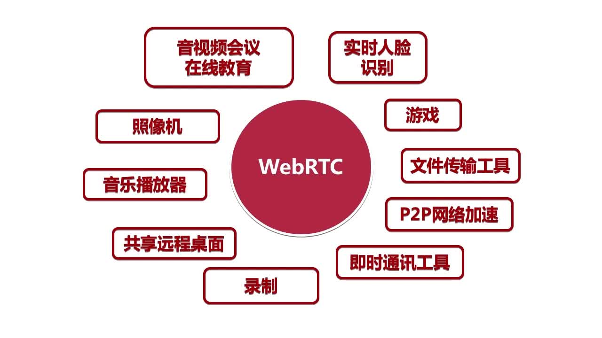
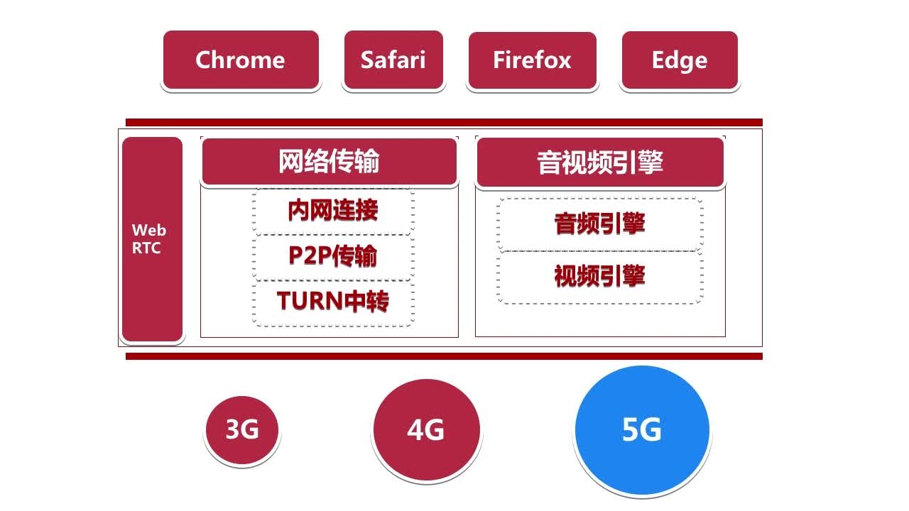
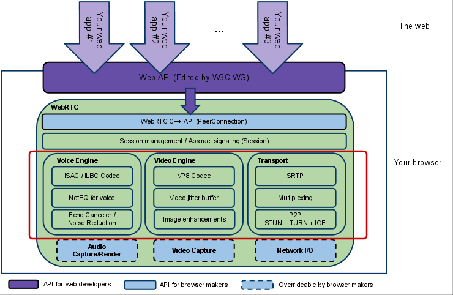
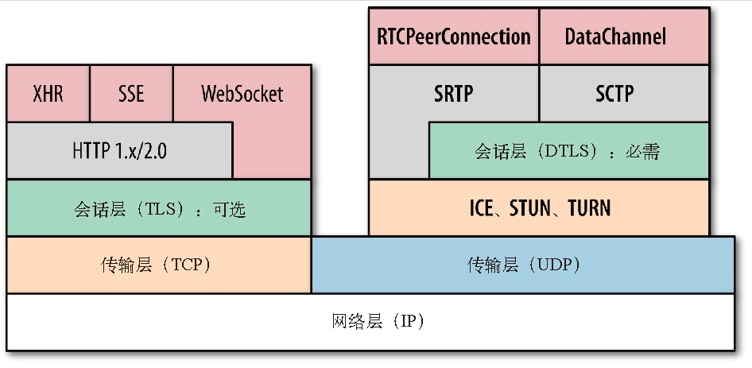
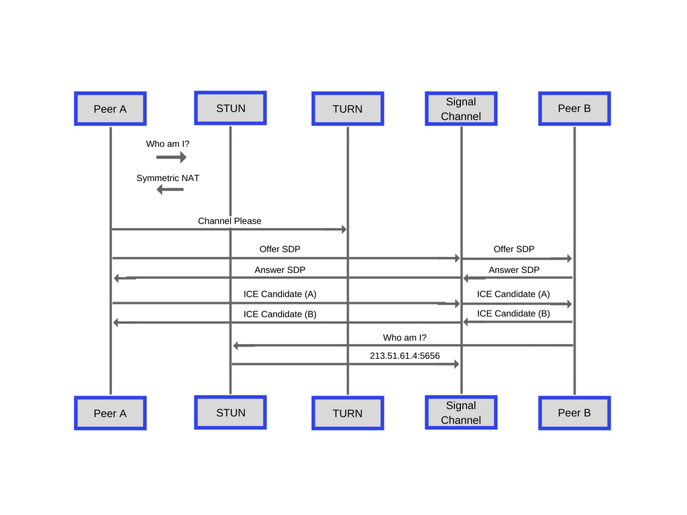

# WebRTC

## 1. WebRTC 介绍

- Google 开源
- 跨平台
- 用于浏览器
- 实时传输
  - 100ms 延迟 通话质量非常好
  - 200ms 延迟 通话质量比较优质
  - 500ms 延迟 可以接受
  - 超过1s 非常迟滞
- 音视频引擎

WebRTC 应用：



WebRTC 愿景：




google webrtc 示例：https://appr.tc/


## 2. WebRTC 原理与架构

## 2.1 WebRTC 概述

- 音视频处理 + 即时通讯的开源库
- 





> [WebRTC之PeerConnection的建立过程](https://www.cnblogs.com/cther/p/myPeerConnection.html)
>
> [WebRTC系列（3）：PeerConnection通信建立流程](<https://www.jianshu.com/p/43957ee18f1a>)


## 3. Web服务器原理与Nodejs搭建


## 4. JavaScript 必备知识回顾


## 5. WebRTC设备管理


## 6. WebRTC音视频数据采集


## 7. WebRTC音视频录制实战


## 8. WebRTC信令服务器实现


## 9. WebRTC网络基础补充：P2P/STUN/TRUN/ICE知识


## 10. 端对端1V1传输基本流程


## 11. WebRTC核心之SDP详解


## 12. 实现1V1音视频实时互动直播系统


## 13. WebRTC核心之RTP媒体控制与数据统计


## 14. WebRTC非音视频数据传输


## 15. WebRTC实时数据传输网络协议详解


## 16. Android端与浏览器互通


## 17. iOS端与浏览器互通


## 18. 课程总结


## Reference

> [JavaScript 是如何工作的:WebRTC 和对等网络的机制！](<https://juejin.im/post/5c511219e51d45522c3066c9>)
>
> [深入理解WebRTC](https://segmentfault.com/a/1190000011403597)
>
> [WebRTC架构简介](https://blog.csdn.net/fishmai/article/details/69681595)
>
> [HTTPS证书生成原理和部署细节](<https://www.barretlee.com/blog/2015/10/05/how-to-build-a-https-server/>)
>
> [SSL证书生成流程](<https://www.jianshu.com/p/9091ebd439a0>)


WebRTC的分层协议图：



信令，会话和协议：




## 问题解决里程

node 启动 server 报错：

```shell
events.js:141
      throw er; // Unhandled 'error' event
      ^

Error: listen EACCES 0.0.0.0:443
    at Object.exports._errnoException (util.js:870:11)
    at exports._exceptionWithHostPort (util.js:893:20)
    at Server._listen2 (net.js:1224:19)
    at listen (net.js:1273:10)
    at net.js:1382:9
    at nextTickCallbackWith3Args (node.js:452:9)
    at process._tickCallback (node.js:358:17)
    at Function.Module.runMain (module.js:444:11)
    at startup (node.js:136:18)
    at node.js:966:3
[Solve]$ sudo setcap 'cap_net_bind_service=+ep' $(readlink -f $(which node))
```

查询端口是否别占用：

```shell
$ netstat -ntpl | grep 443
```


